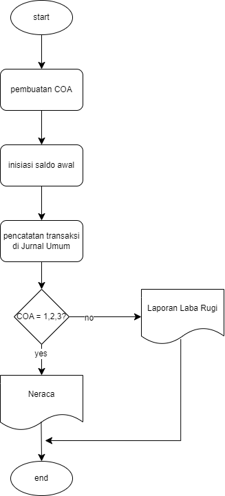

## Basic Accounting
A. Pembuatan COA / Akun

    1-Aset (Assets): Akun yang mencatat semua aset yang dimiliki oleh entitas, seperti kas, piutang, persediaan, dan peralatan.
        jenis aset : 
            - current asset/aset lancar(kas, bank, deposito, investasi jangka pendek, piutang, kasbon, reimburse, prepaid order - PPN/pajak masukan dari pembelian barang, prepaid order - bayar sewa barang)
            - fix asset/aset tidak lancar (tangible - meja, kursi, intangible - LIS)
            - other asset (menyimpan akumulasi biaya dari pengembangan sistem/produk) 

    2-Kewajiban (Liabilities): Akun yang mencatat semua kewajiban atau utang yang harus dibayar oleh entitas, seperti hutang dagang, pinjaman, dan utang pajak.
        jenis liabilitas : 
            - current liabilities: hutang dagang, hutang non dagang, hutang ekspedisi, hutang pajak (ppn keluaran)

    3-Ekuitas (Equity): Akun yang mencatat kepemilikan pemilik dalam entitas, seperti modal awal/saham, laba/rugi ditahan (nilai laba tetap), laba berjalan, rugi berjalan
        case retain earning:
            2015- laba 5jt
            2016-rugi 3jt
            2017-laba 2jt

    4-Pendapatan (Revenue): Akun yang mencatat semua pendapatan yang diperoleh entitas dari operasional, seperti penjualan, pendapatan jasa.

    5-HPP : diskon penjualan, retur, segala hal yang berhubungan dengan produk yang dijual (ongkir, transport, dkk)

    6-Beban (Expenses): Akun yang mencatat semua biaya yang dikeluarkan oleh entitas, seperti gaji, sewa, dan utilitas(internet, listrik)
    di WMI, beban internet masuk ke COA HPP karena berhubungan dengan produksi

    7-Lain-lain Usaha
    misalnya, charge pada transaksi Bank

B. Inisiasi saldo awal
update saldo di akhir tahun akan menjadi saldo awal di tahun berikutnya

C. jurnal - pencatatan transaksi

D. neraca - untuk melihat posisi keuangan  

COA - 123
(aset= hutang + modal)

 contoh kasus :
 
                penjualan : 3000.000 - kredit
                
                ppn 330.000 - kredit
                
                piutang 3.330.000 - debit

E. Laporan Laba rugi 

COA - 4567

pendapatan, HPP, beban

(laba kotor = pendapatan - HPP - beban)

F. Laporan Arus Kas - untuk melihat penggunaan kas (surplus/defisit)

surplus = uang masuk > uang keluar

# Flow General Accounting

# Contoh kasus
Berikut ini data transaksi dari suatu Usaha

1 Januari: Modal awal Rp100.000.000 disetor tunai.

3 Januari: Membeli persediaan buku seharga Rp30.000.000 secara tunai.

5 Januari: Menjual buku dengan harga Rp20.000.000 secara tunai. Harga pokok penjualan buku tersebut adalah Rp12.000.000.

7 Januari: Membayar gaji karyawan sebesar Rp5.000.000.

10 Januari: Membayar sewa toko sebesar Rp2.000.000.

15 Januari: Menjual buku dengan harga Rp25.000.000 secara kredit. Harga pokok penjualan buku tersebut adalah Rp15.000.000.

20 Januari: Menerima pembayaran dari penjualan kredit pada 15 Januari sebesar Rp25.000.000.

25 Januari: Membeli persediaan buku lagi seharga Rp10.000.000 secara kredit.

30 Januari: Membayar biaya listrik dan air sebesar Rp1.000.000.

# Pembuatan Jurnal Umum, Neraca, dan Laporan Laba Rugi
Link --> https://docs.google.com/spreadsheets/d/1Ds1i0akISXRE6oTd1z7z2n4KcM58okmpPPw0o8ciFYI/edit?usp=sharing
